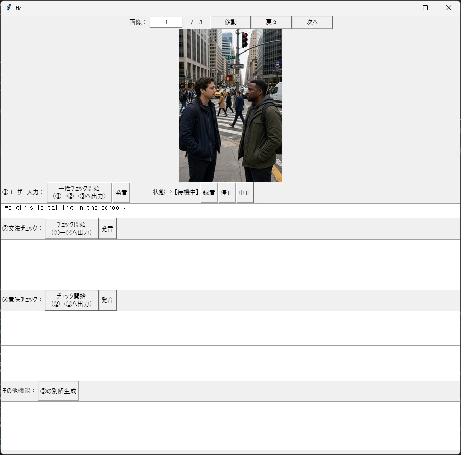
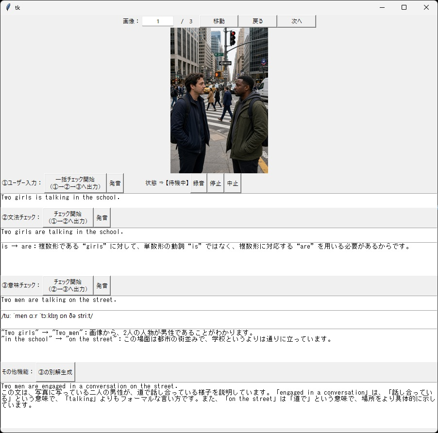
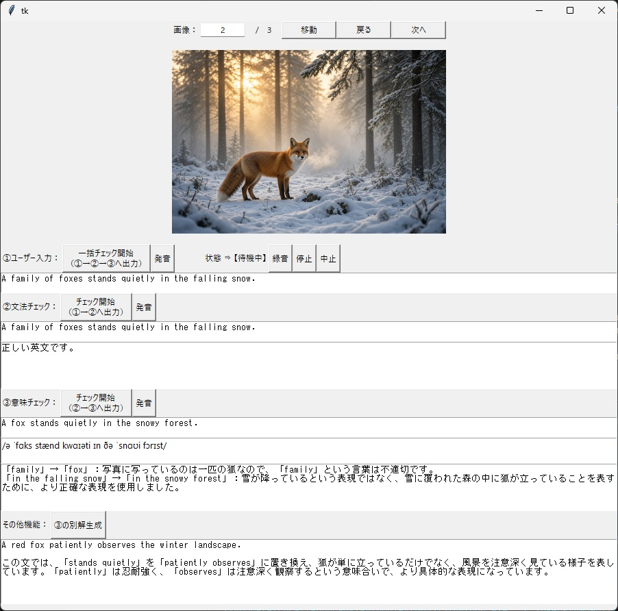
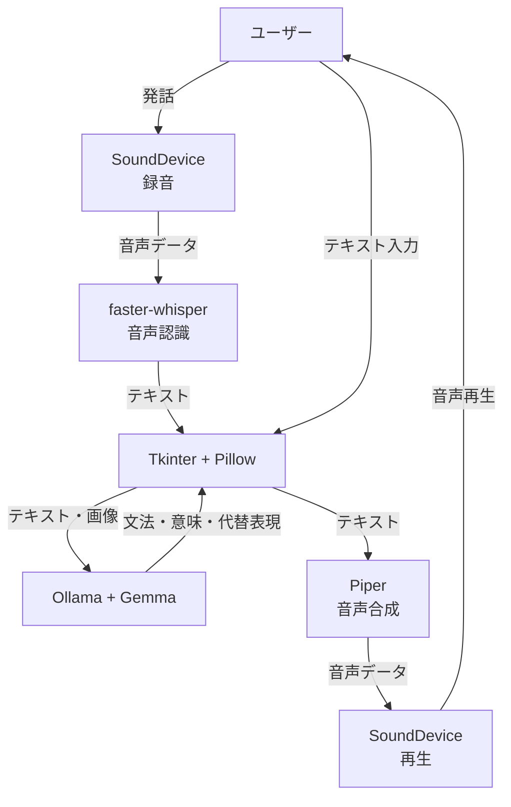

# English Learning System

テキストと画像を入力できるマルチモーダル言語モデルを活用した英語学習システム。
文法チェック、画像内容に合わせた英文修正、発音の確認、代替表現の生成を通して、英語を学習できます。

## 概要

本システムは、英語学習者向けに以下の流れで学習をサポートします。

1. ユーザーが表示された画像を説明する英語を発話、またはキーボードで入力する。
2. 入力した英文をマルチモーダル言語モデルが文法的に正しい英文へ修正し、修正理由とともに画面に提示する。
3. 文法修正後の英文と画像をもとに、画像内容に合うように英文を修正し、修正理由とともに画面に提示する。
4. 生成された発音記号や読み上げ機能を使って英文の発音を確認できる。
5. 別表現の生成機能を利用することで、別の表現方法を学べる。

## 動作イメージ





## 主な機能

### 音声入力

キーボードからの入力だけではなく、マイクからの音声入力に対応。
SoundDeviceで取得した音声をfaster-whisperでテキストに変換することで音声入力機能を実現しています。

### 文法チェック

入力した英文をマルチモーダル言語モデルに入力し、文法的に正しい英文へ修正します。
修正後の英文に加えて、どの部分が誤っていたのか、どのように修正したのかを確認できます。

### 画像内容に合わせた英文修正

文法チェック後の英文と画像をマルチモーダル言語モデルに入力し、画像の内容をより正確に表現する英文へ修正します。
また、入力した英文が画像の内容を適切に表現できていなかった理由と、修正した理由を確認できます。

### 発音確認

画像内容に合わせて修正された英文から発音記号を生成し、英文の発音を確認できます。
また、読み上げ機能を利用して、生成された英文の音声を確認できます。

### 代替表現の生成

画像内容に合わせて修正された英文と同じ内容を表す別の英文を生成し、その英文について解説します。
同じ内容を異なる英語表現で伝える方法を学習できます。

## システム構成


## 使用技術

- SoundDevice
  音声の録音・再生に使用
  
- faster-whisper
  音声認識（Speech-to-Text）に使用

- Piper
  音声合成（Text-to-Speech）に使用

- Ollama
  マルチモーダル言語モデル（Gemma）の実行に使用

- Gemma 3 4B
  文法修正・画像内容に合わせた英文修正・代替表現の生成に使用

- Tkinter / Pillow
  GUI構築・画像表示に使用

- NumPy
  音声データの処理に使用

## 工夫した点

### 画像を使った英文構築の訓練

英語で話しかけられた際に、咄嗟に英語が出てこないことがありました。
学校教育や書籍を使った英語学習では会話の速度に合わせて英文を構築する機会が少ないことが原因だと考えました。

そこで、画像を見てその内容を英文で表現することで、英文を瞬時に構築する訓練ができるようにしました。

### 自分の英文を確認できる仕組み

書籍を使った英語学習では、自分で作った英文が正しいのか確認するのが難しいと感じていました。

そこで、マルチモーダル言語モデルを利用して自分の英文の誤りを確認できるようにしました。

### 文法と表現を分けた学習

文法的に正しい英文でも、画像の内容を適切に表現できているとは限りません。

そこで、「文法チェック」と「画像内容に合わせた英文修正」を分け、文法上の誤りと、画像に対する表現の適切さを分けて学べるようにしました。

### 複数の表現を学べる仕組み

語彙力が少ないと、毎回同じ表現を使いがちになります。

そこで入力された英文と同じ内容を表す別の英文を生成することで、新たな表現を学べる機会を得られるようにしました。

### 発音を確認できる仕組み

学校教育やTOEICなどの試験では、単語の正確な発音を知らなくても問題を解けるため、発音の学習は後回しになりがちです。

そこで、修正された英文から発音記号を生成し、さらに音声読み上げ機能を利用することで、英文の発音を学べるようにしました。

### LLMへの入力方法の工夫

マルチモーダル言語モデルにテキストだけを入力する場合と比べて、テキストと画像を入力すると回答の精度が落ちる傾向が見られました。
例えば出力の形式が守られなかったり、日本語での出力を要求しているにも関わらず英語で出力されたりすることがありました。

そこで、画像を必要としない処理は画像を必要とする処理から切り離し、テキストだけで処理するようにしました。

また、プロンプトで漏れなく全てを指示しようとするほどプロンプトが長くなり、モデルが指示を遵守しにくくなる傾向が見られました。

そこで、必要最低限の指示に絞りプロンプトを可能な限り短くすることで、より良い結果が得られるようにしました。

## 動作環境
- OS：Windows 11
- CPU：Intel Core i7-8700K
- GPU：NVIDIA GeForce RTX 2080 Ti
- メモリ：32GB
- Python：3.13

## 制約事項

本システムではローカル環境でマルチモーダル言語モデルを実行するため、使用するPCの性能や入力内容によって処理速度や安定性が変化します。

また、Gemma 3 4Bを使用しているため、より大規模なモデルと比較すると、英文の修正や画像内容の理解において精度に限界があります。

特に長いテキストや誤りを多く含むテキストを入力した場合、英文の修正や画像内容の理解などにおいて、精度が低下する傾向があります。

## 実行方法

### 前提条件

- Python 3.13 以上
- [Ollama](https://ollama.com/) がインストールされていること
- Git

### 1. リポジトリをクローン

プロジェクトを保存したいフォルダへ移動し、リポジトリをクローンします。

```bash
cd <保存先のパス>
git clone https://github.com/tacocat-jp/english-learning-system.git
cd english-learning-system
```

### 2. 仮想環境の作成と有効化

```bash
python -m venv venv
venv\Scripts\activate
```

### 3. 必要なライブラリをインストール

```bash
pip install -r requirements.txt
```

### 4. Ollamaの準備

使用するGemmaモデルを準備します。

```bash
ollama pull gemma3:4b
```

使用するモデルは `src/Common/config.ini` の以下で指定されています。

```ini
model_name = gemma3:4b
```

必要に応じて編集してください。

### 5. Piperの音声モデルを準備

音声モデルを `data/voice` にダウンロードします。

（例：en_US-lessac-high を使用する場合）

```bash
python -m piper.download_voices --data-dir data/voice en_US-lessac-high
```

### 6. 学習用画像を準備

学習に使用する画像を `data/image` に配置してください。

対応拡張子は `src/Common/config.ini` の以下の設定で指定されています。

```ini
extensions = .jpg, .jpeg, .png
```

必要に応じて拡張子を追加してください。

### 7. アプリケーションを起動

```bash
python main.py
```

## 今後の展望

現在はGPU性能の制約により、応答速度と精度のバランスを取ってGemma 3 4Bを利用しています。

高性能なGPUを利用することでリアルタイム応答が可能となり、また高性能な言語モデルの利用により精度向上も見込めます。

さらに、日常会話と添削を同時に行う機能も実現できると考えています。
